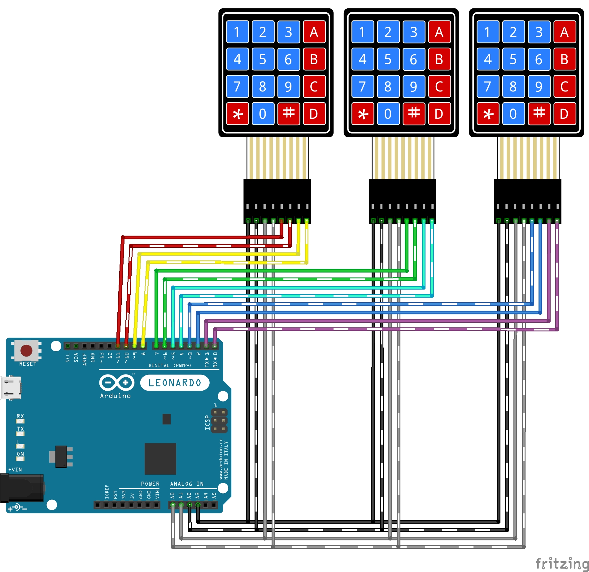

# 48 Buttons Control Deck for PC

> by Jordi Vilaplana Martí, 2021
>
> licensed under the [EUPL v1.2](https://joinup.ec.europa.eu/collection/eupl/eupl-text-eupl-12) or later

---

With PC software being more and more complex over time and with more features
packed with each upgrade (let's not forget about add-ons and plug-ins) we
often end up buried under an ever increasing list of shortcuts
(I'm looking at you, [Microsoft Visual Studio](https://docs.microsoft.com/en-us/visualstudio/ide/default-keyboard-shortcuts-in-visual-studio?view=vs-2019 "Default keyboard shortcuts - Visual Studio (Windows) | Microsoft Docs"),
and your double-combo shortcuts), but our common keyboard doesn't come
with so many keys, right? Well... _Not quite._

It turns out that many OS have built-in key codes for keys... **That are not
(usually) in our keyboards!** Like the F13-24 keys, which are already present
at both [.NET 5](https://docs.microsoft.com/en-us/dotnet/api/system.windows.forms.keys?view=net-5.0 "Keys Enum (System.Windows.Forms) | Microsoft Docs")
and [Arduino Keyboard](https://github.com/arduino-libraries/Keyboard/blob/master/src/Keyboard.h "Keyboard/Keyboard.h at master · arduino-libraries/Keyboard")
SDKs and supported by Windows.
So, if our keyboard doesn't have these keys, **let's make our own!**

## Project introduction

**Arduino LEONARDO/MICRO powered 48 buttons control deck for PC.**

This project uses three 4x4 buttons matrixes since this is a quite commonly
available component at local and on-line stores. Arranged side-by-side
it offers four full 12 button rows mapped to the F13-24 keys
with modifier keys (Ctrl & Alt & Shift on Windows).

The key arrangement is as follows:
- **Row 1 (bottom):** F13-24
- **Row 2:** Ctrl + F13-24
- **Row 3:** Alt + F13-24
- **Row 4 (top):** Shift + F13-24

## Compatibility (board)

This design and code was first intended to use with
**Arduino MICRO and LEONARDO** boards.
Other 32u4 and SAMD controller based boards may be compatible.

More info at [Arduino Reference for Keyboard library](https://www.arduino.cc/reference/en/language/functions/usb/keyboard/ "Keyboard - Arduino Reference") (required for this project).

## Compatibility (keyboard)

Albeit not very common, there are already available PC keyboards
with F13-24, macro and G1-12 keys. If your keyboard already has F13-24 keys you
probably aren't going to need this.

For keyboards with macro and/or G1-12 keys, those are usually mapped to
F13-24 keys. Please check your keyboard firmware to avoid issues and/or
collisions with these keys.
